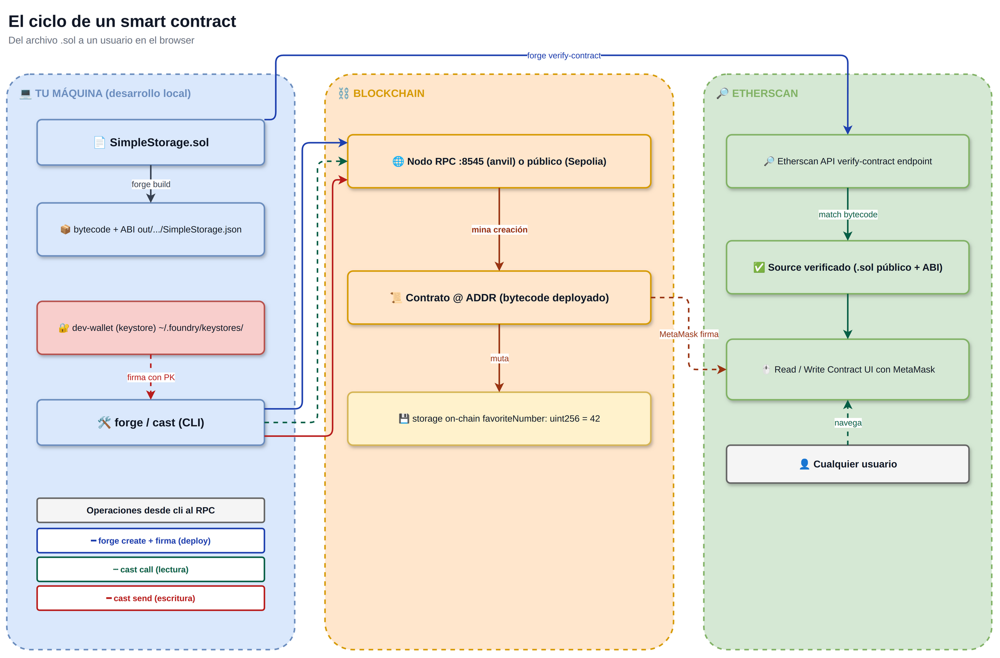
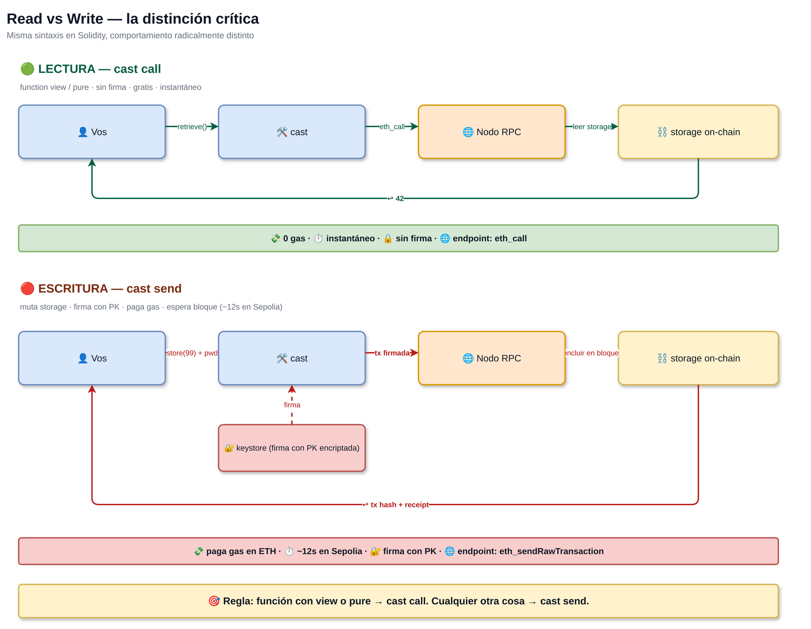
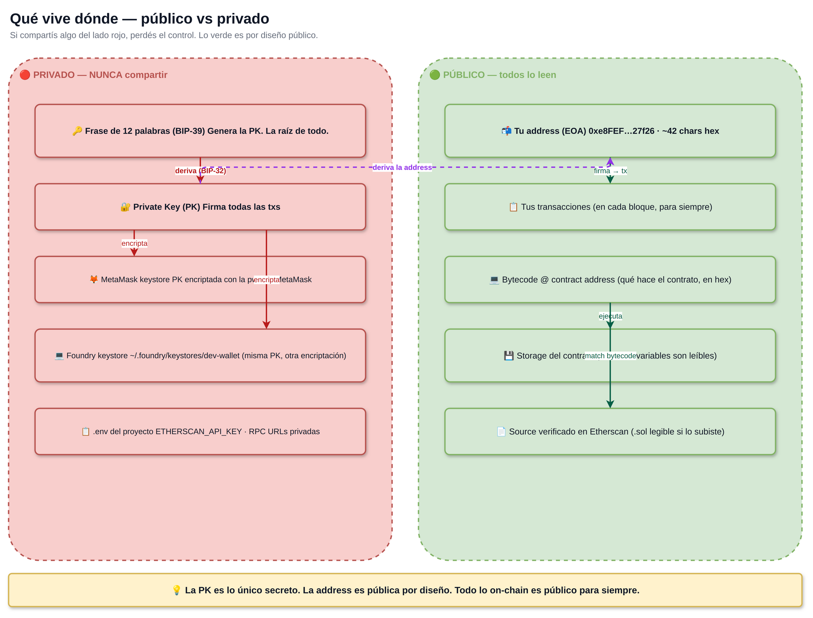
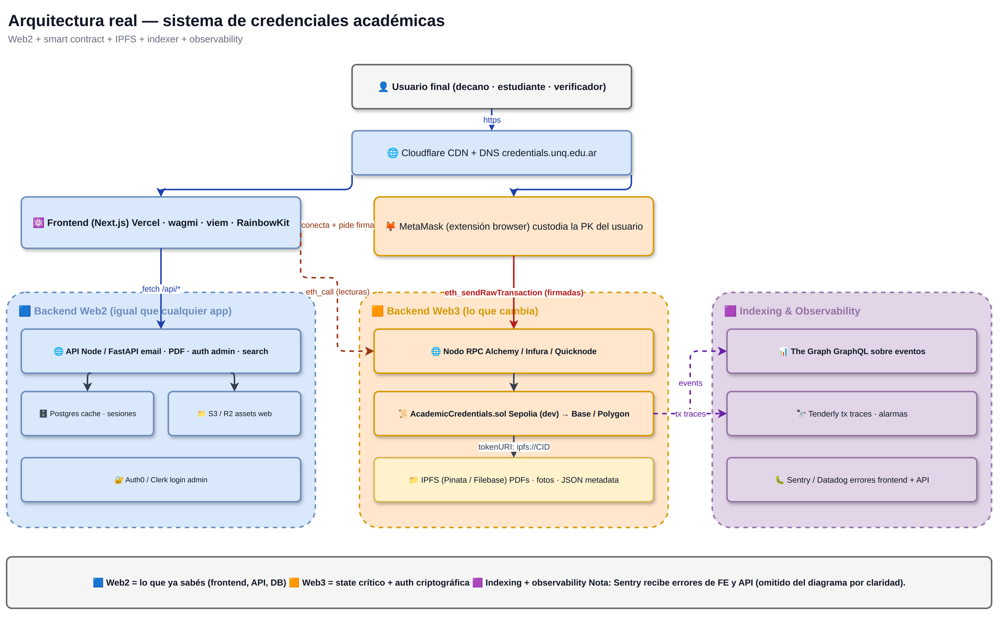
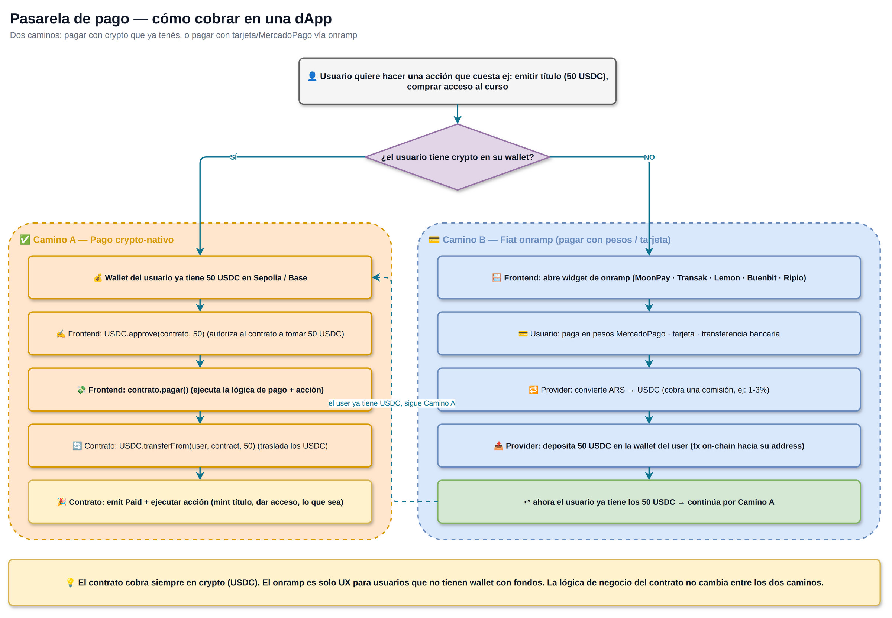

# Blockchain & Pasarela de Pago — Overview

## Contexto — recuerden lo que dice el TPC

> Recuerden que el **core de la asignatura** es el desarrollo de un sistema informático, y que **independientemente del dominio o tipo de sistema que propongan** (e-commerce, plataforma de servicios, marketplace, sistema de reservas, etc.), todos los proyectos deberán **incorporar obligatoriamente una pasarela de pago como parte de su arquitectura**.
>
> La pasarela debe contemplar el **registro y validación de transacciones usando blockchain** y modelar correctamente: la conexión entre pagador y receptor, la gestión de transacciones, la confirmación del pago y el registro inmutable de la operación.
>
> El **MVP funcional con la red de pagos basada en blockchain** representa el **70 % del criterio de evaluación técnica** del trabajo.

> ⚠️ **Aclaración del cuerpo docente — cómo lo vamos a hacer en este Seminario**: aunque el TPC general habilita "simulada o real", **acá no aceptamos simulado**. La pasarela tiene que correr **real sobre Sepolia (testnet de Ethereum)**: contrato deployado y verificado en Etherscan, transacciones firmadas desde MetaMask, eventos `Paid(...)` consumibles por su backend. Sepolia es testnet — **no se gasta plata real, el ETH sale gratis de un faucet** — pero el rail es exactamente el mismo que mainnet. Simular un "pago blockchain" con una tabla en Postgres no cuenta.

**Estas 4 clases son el camino corto y técnico para llegar ahí**: integrar pagos reales en Sepolia en su proyecto, sin importar si eligieron VibeCheck, DepFund, RNW o IDEAFY — o cualquier otro dominio.

> **Analogía rápida**: lo que vamos a hacer es **igual a integrar MercadoPago** en una app — solo que el rail de pago es la blockchain de Ethereum (testnet Sepolia), y el "saldo" del usuario son tokens USDC en su wallet, no pesos en MP.

---

## Cómo se conecta con lo que ya saben

| Lo que YA saben (TP0–TP2) | Cómo lo usan en su sistema con blockchain |
|---|---|
| **k3s + Docker** (TP0) | Despliegan su **frontend + API web2** ahí. El contrato vive en Ethereum, no en su cluster. |
| **Selenium scraping** (TP1) | Pueden ser la fuente de datos de su sistema (ej: VibeCheck scrapeando Bombo para listar eventos). |
| **CI/CD + tests** (TP1 P2) | Los **tests del contrato Solidity** se corren en CI también. Foundry produce reportes que se enchufan en su pipeline. |
| **Loki + OpenTelemetry** (TP2) | Loguean **eventos on-chain** y los correlacionan con logs de su backend. Cada `event Paid(...)` se mapea a un span. |

**Web3 NO reemplaza Web2** — augmenta. Su backend Node/Python sigue ahí, su frontend sigue ahí, su observabilidad sigue ahí. Lo que se reemplaza es solo:

- **MercadoPago** → contrato `PaymentGateway.sol` en Sepolia.
- **Auth con email+password** → firma criptográfica de wallet (SIWE).
- **Base de datos para estado crítico** (ownership de tokens, balances) → storage on-chain del contrato.

---

## Roadmap (4 clases × ~4 hs)

| Clase | Tema | Lo que se llevan armado |
|---|---|---|
| **1** — Fundamentos + setup | MetaMask + Sepolia + Foundry + un primer contrato `SimpleStorage` deployado | Un contrato propio en Sepolia, verificable en Etherscan |
| **2** — ERC-20 + PaymentGateway | Tokens fungibles (su moneda interna) + contrato `PaymentGateway` que cobra USDC + protección contra reentrancy | El contrato base que extienden para su proyecto |
| **3** — Frontend + integración | Next.js + wagmi + RainbowKit hablando con su PaymentGateway + onramp testnet | Una dApp deployada en Vercel con MetaMask conectado |
| **4** — NFTs gamificación + Slither | Set Bonus NFT (ERC-721) + análisis estático con Slither + cómo plugar el patrón a VibeCheck/DepFund/RNW/IDEAFY | El stack completo + auditoría |

---

## Diagramas hero

Estos 5 diagramas cubren todo el modelo mental. Recurrir a ellos durante el desarrollo de su sistema.

### 1 · El ciclo de un smart contract

Del archivo `.sol` que escribís, al contrato deployado, al usuario final que lo usa desde el browser. Tres swim-lanes: **tu máquina** (donde escribís el código), **blockchain** (donde vive el contrato), **Etherscan** (la UI pública del contrato).



---

### 2 · Read vs Write — la distinción crítica

`cast call` (lectura, gratis, instantánea) vs `cast send` (escritura, firma + gas, espera bloque). **Misma sintaxis en Solidity, comportamiento radicalmente distinto**.

> Regla mnemotécnica: si la función dice `view` o `pure` → `cast call`. Cualquier otra cosa → `cast send`.



---

### 3 · Qué vive dónde — público vs privado

Mapa de qué se puede compartir y qué nunca. Lo rojo (private key, frase BIP-39, `.env`) **nunca** sale de su máquina. Lo verde (address, txs, bytecode, storage) es público por diseño — **toda la blockchain es leíble por cualquiera**.



---

### 4 · Arquitectura real del sistema

**Su sistema completo**: Frontend (Vercel) + Backend Web2 (k3s) + Smart Contract (Sepolia) + IPFS para archivos pesados + Indexer (The Graph) + Observabilidad (Loki/Tenderly/Sentry).

> **El contrato es UNA pieza** del sistema, no es todo. Vendría siendo el "servicio de pagos" en una app tradicional. El resto (UI, API, BD, monitoreo) sigue siendo lo de siempre.



---

### 5 · Pasarela de pago — el corazón del TP

**Dos caminos**:
- **A — Crypto-nativo**: el usuario ya tiene USDC. Conecta wallet → approve → pay. Su contrato cobra y emite evento.
- **B — Fiat onramp**: el usuario llega con tarjeta/MercadoPago/transferencia. Un provider (Lemon, Buenbit, MoonPay) convierte ARS → USDC y deposita en su wallet. Después sigue por camino A.

> **Insight clave**: el contrato siempre cobra en crypto (USDC). El onramp es solo UX para usuarios sin wallet con fondos. **La lógica del contrato no cambia entre los dos caminos.**



---

## El contrato base que se llevan

Después de la **clase 2** todos tienen este patrón en la mano:

```solidity
// SPDX-License-Identifier: MIT
pragma solidity ^0.8.24;

import {IERC20} from "@openzeppelin/contracts/token/ERC20/IERC20.sol";
import {ReentrancyGuard} from "@openzeppelin/contracts/utils/ReentrancyGuard.sol";

contract PaymentGateway is ReentrancyGuard {
    IERC20 public immutable usdc;
    address public immutable treasury;

    event Paid(address indexed payer, uint256 amount, bytes32 indexed action);

    constructor(IERC20 _usdc, address _treasury) {
        usdc = _usdc;
        treasury = _treasury;
    }

    function pay(uint256 amount, bytes32 action) external nonReentrant {
        require(amount > 0, "amount=0");
        require(usdc.transferFrom(msg.sender, treasury, amount), "transfer failed");
        emit Paid(msg.sender, amount, action);
        _onPaid(msg.sender, amount, action);
    }

    /// @dev Cada proyecto sobrescribe esto con su lógica:
    ///   - VibeCheck: mintea ticket NFT
    ///   - DepFund: emite shares de $DPF
    ///   - RNW: registra como inversor
    ///   - IDEAFY: rutea al sub-token del proyecto
    function _onPaid(address payer, uint256 amount, bytes32 action) internal virtual {}
}
```

**La pasarela es la misma**. Lo que cambia es qué pasa adentro de `_onPaid`. Cada equipo escribe su propia subclass.

---

## Stack obligatorio para el TP final

| Pieza | Tecnología | Mainnet/testnet |
|---|---|---|
| **Smart contract** | Solidity 0.8.24 + OpenZeppelin + Foundry | Sepolia testnet |
| **Stablecoin** | USDC oficial de Circle en Sepolia ([`0x1c7D…7238`](https://sepolia.etherscan.io/address/0x1c7D4B196Cb0C7B01d743Fbc6116a902379C7238)) | Sepolia |
| **Frontend** | Next.js + wagmi + viem + RainbowKit | Vercel (URL pública real) |
| **Wallet** | MetaMask (recomendado) o WalletConnect | Sepolia |
| **Onramp testnet** | TestnetOnramp custom (clase 3) | Sepolia |
| **Indexer (opcional)** | The Graph subgraph | Hosted Service |
| **Observabilidad** | Loki/Tenderly/Sentry (lo que ya tienen de TP2) | — |
| **Backend Web2** | Node/Python en k3s (lo que ya tienen) | — |

---

## Material relacionado

- [Programa del Seminario](#) — el doc que define el TP
- [TP 0 — Kubernetes](practica-0.html)
- [TP 1 — Selenium MercadoLibre](practica-1-parte-1.html)
- [TP 2 — Observabilidad](practica-2-parte-1.html)
- **Próximamente**: las 4 clases de blockchain (links cuando estén publicadas).
